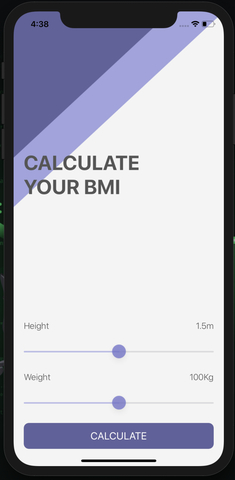
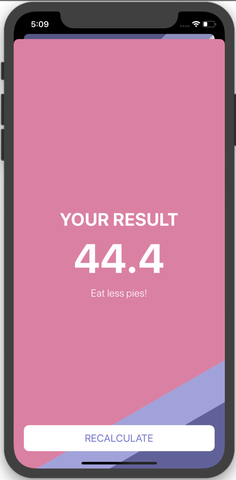

# BMI Calculator

## O Projeto

Calculador de indice de Massa Corporal (IMC). Baseado na altura e peso do usu�rio � calculado seu �ndice de massa corporal o IMC, e retorna uma mensagem de saude de acordo com o resultado.

## The Project

Body Mass Index calculator. Based on the user’s weight and height it will calculate their body mass and give a piece of health advice depending on whether if they have eaten too many pies or if they need to eat more pies.

## Application Pages

> This is a companion project to The App Brewery's Complete App Development Bootcamp, check out the full course at [www.appbrewery.co](https://www.appbrewery.co/)
